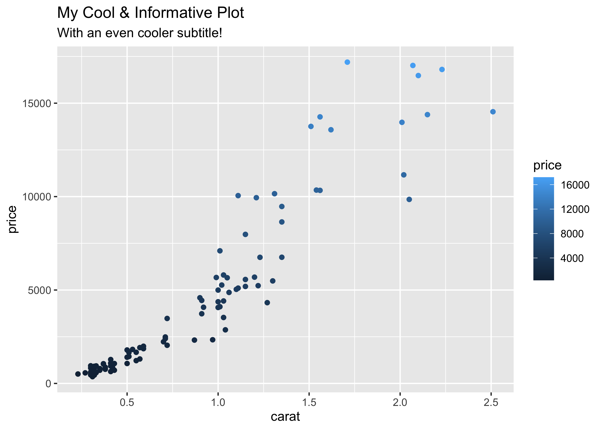

<!-- README.md is generated from README.Rmd. Please edit that file -->

# ggchameleon 

<!-- badges: start -->
<!-- badges: end -->

ggchameleon allows you to write standard
[ggplot2](https://cran.r-project.org/web/packages/ggplot2/index.html)
syntax while automatically theming your plots with user-specified or
algorithmically determined colors and fonts. ggchameleon balances
unobtrusiveness with reprodroducibility, allowing the user to save a
`chameleon.yml` file which stores customized ggplot theming without
requiring the user to write extra code to fetch this theming.

## Installation

You can install the development version of ggchameleon from
[GitHub](https://github.com/) with:

``` r
# install.packages("devtools")
devtools::install_github("aarongraybill/ggchameleon")
```

## Design Principle

ggchameleon gets its name from two key design principles:

1.  The chameleon’s ability to change colors at will
2.  The chameleon’s ability to blend into the background of its
    environment.

On the color changing side, ggcchameleon allows the user to flexibly
change theme elements (color, font, size of lines, etc.). ggchameleon is
written to make these changes reproducible and easy to access with the
`save_current_theme` function.

However, much a like a real chameleon in dense rain forest foliage,
ggchameleon is very hard to spot in your code! ggchameleon both reduces
boilerplate and maintains compatability with standard `ggplot2`. In
fact, when used as intended, the only place ggchameleon appears in your
scripts is `library(ggchameleon)`. All of the theming is loaded on
startup from your configurations or the package defaults. If you were to
remove the `library(ggchameleon)` at the beginning of your code, you
would produce plots with exactly the same information, now in the
default ggplot theme.

## Basic Usage

First, here’s how a standard ggplot2 looks:

``` r
library(ggplot2)
library(dplyr)

set.seed(1)
d <- diamonds |> slice_sample(n=1000)
ggplot(d)+
  geom_point(aes(x=carat,y=price,color=cut))+
  ggtitle("My Cool Title")
```



Now, if we load the ggchameleon package we can immediately see a change
in how the plot looks:

``` r
library(ggchameleon)
#> Installing Fonts
#> Installing Fonts
ggplot(d)+
  geom_point(aes(x=carat,y=price,color=clarity))
```


But the real magic of ggchameleon comes when we wish to alter the
default ggchameleon parameters:

``` r
ggchameleon:::edit_the_main_palette(main = "#FF0000")
ggplot(d)+
  geom_point(aes(x=carat,y=price,color=clarity))
```


`main` in the above example is the main color used throughout the plot
and in the title text’s color. We can edit any of the colors, but we can
also edit any of the fonts, as seen below:

``` r
ggchameleon:::edit_the_fonts(sans="Press Start 2P")
#> Installing Fonts
ggplot(d)+
  geom_point(aes(x=carat,y=price,color=clarity))
```


We can also edit elements of the theme that we apply to each plot by
default, for example:

``` r

ggchameleon:::edit_the_theme(legend.position = "None")

ggplot(d)+
  geom_point(aes(x=carat,y=price,color=clarity))
```


Now that we’ve edited the theming to our heart’s content, we can save
these modifications for next time we use this project. If we run the
following, we will save a file, `chameleon.yml` which will be
automatically applied the next time we load this project.

``` r
ggchameleon:::save_current_theme()
```
